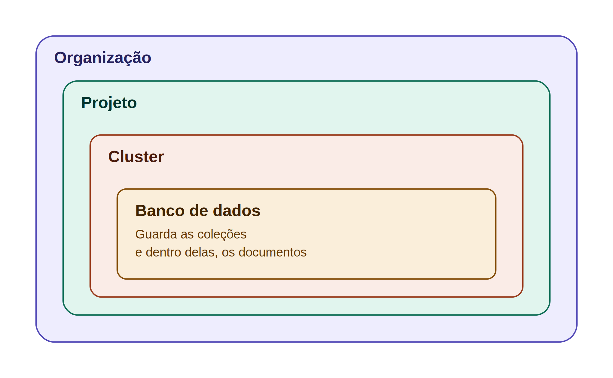

# MongoDB & MongoDB Atlas — Guia Rápido de Estudo

---

## 1. MongoDB x MongoDB Atlas — Diferença rápida (pra decorar)

| | **MongoDB** | **MongoDB Atlas** |
|---|---|---|
| O que é | O banco de dados em si (o software/motor) | O serviço de nuvem que hospeda o MongoDB pra você |
| Onde roda | Você instala e gerencia no seu servidor | Roda na nuvem (AWS, Azure ou GCP), gerenciado pela MongoDB Inc |
| Quem cuida | Você (infra, backup, updates, segurança) | A própria plataforma cuida disso |
| Resumo mental | **MongoDB = o banco de dados** | **Atlas = o "banco de dados como serviço" (DBaaS)** |

**Frase pra decorar:** *"MongoDB é o motor, Atlas é a garagem pronta que já vem com o carro montado e a manutenção incluída."*

---

## 2. Hierarquia do Atlas (o que vocês criaram)



*(Dentro do Banco de dados ficam as Coleções, e dentro de cada Coleção ficam os Documentos — são vários itens, por isso não dá pra desenhar como quadrado fixo, mas seguem a mesma lógica de "dentro de".)*

**Explicando cada nível:**
- **Organização** → conta "mãe", agrupa todos os projetos (ex: sua empresa)
- **Projeto** → agrupa clusters relacionados a um mesmo produto/time (ex: "E-commerce", "App de Delivery")
- **Cluster** → o servidor/instância do banco rodando (onde os dados ficam de fato). É onde os documentos ficam armazenados **em memória persistente** (salvos em disco, não se perdem ao desligar). Quando você cria um cluster, o Atlas cria automaticamente **3 computadores (nós)**: **1 principal (Primary)**, que recebe as escritas, e **2 backups (Secondary)**, que ficam copiando os dados do principal em tempo real. Se o principal cair, um dos backups assume sozinho, sem downtime. Esse conjunto de 3 nós se chama **Replica Set**.
- **Banco de Dados** → dentro do cluster, separa dados por contexto (ex: banco "delivery")
- **Coleção** → equivalente a uma "tabela" no relacional (ex: Restaurantes, Entregadores)
- **Documento** → equivalente a uma "linha/registro", em formato JSON

---

## 2.1 Glossário — outros termos que aparecem na interface do Atlas

| Termo | O que é |
|---|---|
| **Data Explorer** | Tela onde você navega e visualiza os dados (bancos, coleções, documentos) dentro do cluster |
| **My Queries** | Local pra salvar consultas (queries) que você usa com frequência, sem precisar reescrever |
| **Data Modeling** | Ferramenta do Atlas pra ajudar a planejar a estrutura das coleções/documentos antes de criar |
| **Documents** | Aba que mostra os documentos de uma coleção — o número ao lado é a quantidade total (ex: "Documents 2") |
| **Aggregations** | Aba pra montar pipelines de agregação — consultas mais avançadas (somar, agrupar, filtrar em etapas) |
| **Schema** | Aba que mostra a "forma" dos dados daquela coleção — analisa os documentos e sugere os tipos de campo mais comuns |
| **Indexes** | Aba dos índices da coleção — estruturas que aceleram buscas (parecido com o índice de um livro) |
| **ADD DATA** | Botão pra inserir um novo documento manualmente ou importar um arquivo (JSON/CSV) |
| **BULK** | Inserir/editar vários documentos de uma vez, em lote |
| **EXPORT CODE** | Gera o código (em várias linguagens) equivalente à consulta que você montou na tela, pronto pra colar no seu projeto |
| **Generate Query** | Recurso de IA do Atlas que monta a query em MongoDB Query Language a partir de uma descrição em texto |
| **ObjectId** | Tipo de dado que o MongoDB usa por padrão no campo `_id` — um identificador único gerado automaticamente pra cada documento |
| **Array** | Campo que guarda uma lista de valores ou objetos dentro do próprio documento (ex: `veiculos: Array(2)`) |
| **Object** | Quando um item dentro de um Array (ou um campo) é, ele mesmo, um conjunto de outros campos (documento aninhado) |
| **admin** / **local** | Bancos internos que o MongoDB cria automaticamente em todo cluster — `admin` guarda dados de autenticação/administração, `local` guarda dados específicos daquele nó (não é replicado) |

---

## 3. Banco Relacional x Não Relacional — Resumo rápido

| | **Relacional (SQL)** | **Não Relacional (NoSQL / MongoDB)** |
|---|---|---|
| Estrutura | Tabelas com linhas e colunas fixas | Coleções com documentos JSON flexíveis |
| Schema | Rígido — todas as linhas seguem o mesmo formato | Flexível — documentos podem variar |
| Relacionamento | Usa chaves estrangeiras (JOIN entre tabelas) | Geralmente dados aninhados dentro do próprio documento |
| Exemplo | Tabela `clientes` + Tabela `pedidos` ligadas por `cliente_id` | Documento `pedido` já contém os dados do cliente dentro dele |
| Exemplos de banco | MySQL, PostgreSQL, SQL Server | MongoDB, Firebase, DynamoDB |

### Exemplo prático da diferença

**Relacional (SQL):**
```
Tabela: clientes
| id | nome  |
| 1  | Ana   |

Tabela: pedidos
| id | cliente_id | produto |
| 1  | 1          | Pizza   |
```
→ Precisa de **JOIN** pra juntar cliente com pedido.

**Não relacional (MongoDB):**
```json
{
  "cliente": "Ana",
  "pedido": "Pizza"
}
```
→ Já vem tudo **junto no mesmo documento**, sem precisar de JOIN.

**Frase pra decorar:** *"Relacional separa e depois junta com JOIN. Não relacional já guarda junto."*

---

## 4. Comparação — Principais diferenças (visão geral)

| Critério | Relacional | Não Relacional (MongoDB) |
|---|---|---|
| Estrutura de dados | Tabelas | Documentos JSON |
| Flexibilidade de schema | Baixa | Alta |
| Escalabilidade | Vertical (mais forte é o servidor) | Horizontal (mais servidores/shards) |
| Melhor uso | Dados muito estruturados, com muitas relações (ex: sistema bancário) | Dados variáveis, alto volume, leitura/escrita rápida (ex: catálogo de produtos, apps) |
| Linguagem de consulta | SQL | Consultas baseadas em JSON (find, aggregate) |
| Integridade | Forte (ACID nativo) | Também suporta ACID, mas prioriza performance/flexibilidade |

---

## 5. Banco MongoDB na prática — o que fizemos na aula

Estrutura real que criamos no Atlas:

```
Organização: EBD2-Turma-2
 └── Projeto: HelloMongo
      └── Cluster: HelloMongo
           └── Banco: app
                ├── Coleção: entregadores (2 documentos)
                └── Coleção: restaurantes
```

**Coleção `entregadores`** — documentos de exemplo:

```json
{
  "_id": ObjectId("6a7322db9f4c5e39fdc8dfb9"),
  "nome": "Maurício Souza",
  "cpf": "123.123.123-22"
}
```

```json
{
  "_id": ObjectId("6a7323b69f4c5e39fdc8dfba"),
  "nome": "José Aparecido Moraes",
  "cpf": "333.222.111-00",
  "veiculos": [
    {
      "tipo": "MOTOCICLETA",
      "placa": "ABC-1234",
      "anoFabricacao": 2000
    },
    {
      "tipo": "MOTOCICLETA",
      "placa": "BCD-7890",
      "anoFabricacao": "2019"
    }
  ],
  "cnh": "393131311"
}
```

**Repare:** `anoFabricacao` do primeiro veículo é number (`2000`) e do segundo é string (`"2019"`) — outro exemplo de schema flexível, o MongoDB aceita tipos diferentes pro mesmo campo em documentos/objetos diferentes.

**Pontos observados na prática:**
- O `_id` é gerado automaticamente pelo MongoDB como `ObjectId` (identificador único de cada documento)
- Repare que o 1º documento não tem o campo `veiculos`, mas o 2º tem — **schema flexível na prática**, cada documento pode ter campos diferentes
- `veiculos` é um **Array** (lista) dentro do próprio documento — dá pra guardar dados aninhados sem precisar de outra tabela/coleção
- No Data Explorer do Atlas dá pra navegar: Documents, Aggregations, Schema e Indexes de cada coleção

---

## 6. Banco MongoDB — exemplo teórico (fora da aula)

Um banco MongoDB armazena **documentos** (formato JSON) organizados em **coleções**.

```
Coleção: Restaurantes
  Documento 1:
  {
    "nome": "McDonald's",
    "cidade": "São Paulo",
    "horario_funcionamento": "10h às 23h"
  }
  Documento 2:
  {
    "nome": "Burger King",
    "cidade": "Rio de Janeiro",
    "horario_funcionamento": "11h às 00h"
  }

Coleção: Entregadores
  Documento 1:
  {
    "nome": "Entregador A",
    "veiculo": "moto",
    "status": "disponível"
  }
  Documento 2:
  {
    "nome": "Entregador B",
    "veiculo": "bike",
    "status": "em entrega"
  }
```

**Ponto-chave:** cada documento de uma mesma coleção pode ter campos diferentes entre si (schema flexível) — isso é o oposto do banco relacional, onde toda linha da tabela obrigatoriamente segue as mesmas colunas.

---

## ✅ Checklist do que ficou pronto
- [x] MongoDB x Atlas — diferença explicada
- [x] Hierarquia desenhada (Organização → Projeto → Cluster → Banco → Coleções → Documentos)
- [x] Diferença relacional x não relacional com exemplo
- [x] Tabela comparativa geral
- [x] Exemplo real da aula (Organização EBD2-Turma-2, banco `app`, coleção `entregadores`)
- [x] Exemplo teórico complementar
